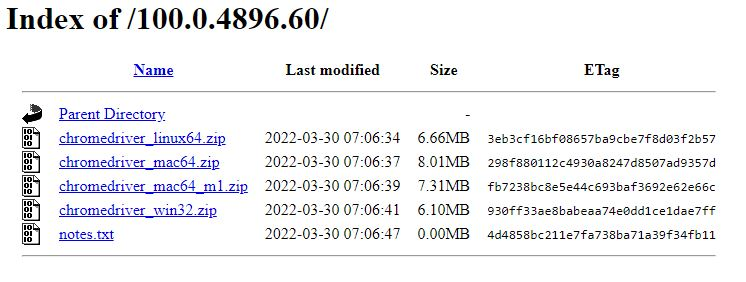

# Tee Time Scheduler

---

> Project Goal: Automate the process of logging into a golf course's members' account and scheduling a tee time every week at the same time. The tee time will be scheduled one week in advance for the following Fridat. So every Friday at 5AM the script should launch and execute the sequential steps required to schedule next Friday's tee time. The user should have control over changing the tee time and day should they require to do so.

---

## Tasks

---

## User Instructions

---

> Setup: Follow the following steps to setup the program and configure your computer to be capable of executing the script.

#### Windows OS Setup

1. Install Python: (Make sure to install the version that fits your operating system)

   - [Follow This Link to the Python Download Page](http://python.org/download)

2. Setup the project directory (This is where the project folder will be located. I recommend putting it in your main user directory)

   - Example: `C:\Users\<User Directory>\TeeTimeScheduler`

3. Install Chrome webdriver: Follow the steps below to install it correctly.

   1. Open Chrome browser. Click the three dots in the top right corner and click on settings.
   2. Once in settings click on About Chrome. It is at the bottom of the menu on the left hand side of the screen.
   3. You should then see in the middle of the screen a Version number. Mine Looks like this: `Version 100.0.4896.127 (Official Build) (64-bit)`
   4. Now that you know your chrome browser version, go to this link to download the [link to download the webdriver](https://chromedriver.chromium.org/home) - if the driver version doesn't match your chrome version exactly, get the one that is closest to the same version number.

    5. Once downloaded, create a folder in the main User home folder named `webdriver` and move the chrome driver from the `downloads` folder to the `webdriver` folder.

   - Example:`C:\Users\<user name>\webdriver`

4. Go to the `TeeTimeScheduler` directory, open the `config` directory, open the `config.ini` file, and then add the path to the webdriver next to `PATH=`
   - Example: `C:\Users\<user name>\webdriver\chromedriver_win32\chromedriver.exe`

**_Inside that same directory, add your members account information. Enter your username and password next to `USERNAME=` and `PASSWORD=`_**
